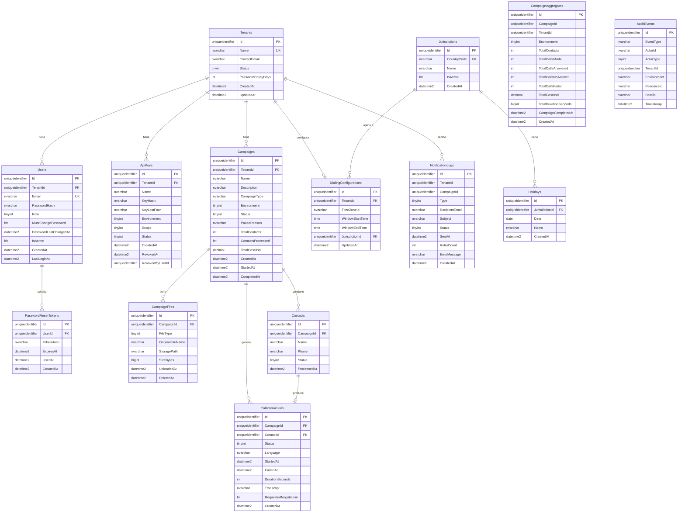

# Diagrama Entidad-Relación — CallMasterAI MVP

> [!NOTE]
> Este documento define las **tablas, columnas, tipos de datos, restricciones y relaciones** para la base de datos PostgreSQL. Se deriva del [modelo de dominio](file:///c:/Users/luisa/source/repos/CallMasterAI/Documents/domain-model.md) y los [specs funcionales](file:///c:/Users/luisa/source/repos/CallMasterAI/Documents/specs).

---

## Diagrama ER



---

## Definición de Tablas

### `Tenants`

```sql
CREATE TABLE Tenants (
    Id              UNIQUEIDENTIFIER    NOT NULL DEFAULT NEWSEQUENTIALID(),
    Name            NVARCHAR(200)       NOT NULL,
    ContactEmail    NVARCHAR(320)       NOT NULL,
    Status          TINYINT             NOT NULL DEFAULT 1,    -- 1=Active, 0=Inactive
    PasswordPolicyDays INT              NOT NULL DEFAULT 90,
    CreatedAt       DATETIME2(7)        NOT NULL DEFAULT SYSUTCDATETIME(),
    UpdatedAt       DATETIME2(7)        NOT NULL DEFAULT SYSUTCDATETIME(),
    CONSTRAINT PK_Tenants PRIMARY KEY (Id),
    CONSTRAINT UQ_Tenants_Name UNIQUE (Name)
);
```

### `Users`

```sql
CREATE TABLE Users (
    Id                      UNIQUEIDENTIFIER    NOT NULL DEFAULT NEWSEQUENTIALID(),
    TenantId                UNIQUEIDENTIFIER    NULL,      -- NULL para PlatformOwner
    Email                   NVARCHAR(320)       NOT NULL,
    PasswordHash            NVARCHAR(500)       NOT NULL,
    Role                    TINYINT             NOT NULL,   -- 0=PlatformOwner, 1=TenantAdmin
    MustChangePassword      BIT                 NOT NULL DEFAULT 0,
    PasswordLastChangedAt   DATETIME2(7)        NOT NULL DEFAULT SYSUTCDATETIME(),
    IsActive                BIT                 NOT NULL DEFAULT 1,
    CreatedAt               DATETIME2(7)        NOT NULL DEFAULT SYSUTCDATETIME(),
    LastLoginAt             DATETIME2(7)        NULL,
    CONSTRAINT PK_Users PRIMARY KEY (Id),
    CONSTRAINT UQ_Users_Email UNIQUE (Email),
    CONSTRAINT FK_Users_Tenants FOREIGN KEY (TenantId) REFERENCES Tenants(Id)
);
CREATE INDEX IX_Users_TenantId ON Users(TenantId);
```

### `PasswordResetTokens`

```sql
CREATE TABLE PasswordResetTokens (
    Id          UNIQUEIDENTIFIER    NOT NULL DEFAULT NEWSEQUENTIALID(),
    UserId      UNIQUEIDENTIFIER    NOT NULL,
    TokenHash   NVARCHAR(500)       NOT NULL,
    ExpiresAt   DATETIME2(7)        NOT NULL,
    UsedAt      DATETIME2(7)        NULL,
    CreatedAt   DATETIME2(7)        NOT NULL DEFAULT SYSUTCDATETIME(),
    CONSTRAINT PK_PasswordResetTokens PRIMARY KEY (Id),
    CONSTRAINT FK_PasswordResetTokens_Users FOREIGN KEY (UserId) REFERENCES Users(Id)
);
CREATE INDEX IX_PasswordResetTokens_UserId ON PasswordResetTokens(UserId);
```

### `ApiKeys`

```sql
CREATE TABLE ApiKeys (
    Id              UNIQUEIDENTIFIER    NOT NULL DEFAULT NEWSEQUENTIALID(),
    TenantId        UNIQUEIDENTIFIER    NOT NULL,
    Name            NVARCHAR(200)       NOT NULL,
    KeyHash         NVARCHAR(500)       NOT NULL,
    KeyLastFour     NVARCHAR(4)         NOT NULL,
    Environment     TINYINT             NOT NULL,   -- 0=Sandbox, 1=Production
    Scope           TINYINT             NOT NULL,   -- 0=Full, 1=ReadOnly
    Status          TINYINT             NOT NULL DEFAULT 0,  -- 0=Active, 1=Revoked
    CreatedAt       DATETIME2(7)        NOT NULL DEFAULT SYSUTCDATETIME(),
    RevokedAt       DATETIME2(7)        NULL,
    RevokedByUserId UNIQUEIDENTIFIER    NULL,
    CONSTRAINT PK_ApiKeys PRIMARY KEY (Id),
    CONSTRAINT FK_ApiKeys_Tenants FOREIGN KEY (TenantId) REFERENCES Tenants(Id)
);
CREATE INDEX IX_ApiKeys_TenantId_Environment_Status ON ApiKeys(TenantId, Environment, Status);
```

### `Campaigns`

```sql
CREATE TABLE Campaigns (
    Id                  UNIQUEIDENTIFIER    NOT NULL DEFAULT NEWSEQUENTIALID(),
    TenantId            UNIQUEIDENTIFIER    NOT NULL,
    Name                NVARCHAR(300)       NOT NULL,
    Description         NVARCHAR(1000)      NULL,
    CampaignType        NVARCHAR(100)       NULL,
    Environment         TINYINT             NOT NULL,
    Status              TINYINT             NOT NULL DEFAULT 0,  -- 0=Draft
    PauseReason         NVARCHAR(100)       NULL,
    TotalContacts       INT                 NOT NULL DEFAULT 0,
    ContactsProcessed   INT                 NOT NULL DEFAULT 0,
    TotalCostUsd        DECIMAL(18,4)       NOT NULL DEFAULT 0,
    CreatedAt           DATETIME2(7)        NOT NULL DEFAULT SYSUTCDATETIME(),
    StartedAt           DATETIME2(7)        NULL,
    CompletedAt         DATETIME2(7)        NULL,
    CONSTRAINT PK_Campaigns PRIMARY KEY (Id),
    CONSTRAINT FK_Campaigns_Tenants FOREIGN KEY (TenantId) REFERENCES Tenants(Id)
);
CREATE INDEX IX_Campaigns_TenantId_Environment ON Campaigns(TenantId, Environment);
CREATE INDEX IX_Campaigns_Status ON Campaigns(Status);
```

### `CampaignFiles`

```sql
CREATE TABLE CampaignFiles (
    Id              UNIQUEIDENTIFIER    NOT NULL DEFAULT NEWSEQUENTIALID(),
    CampaignId      UNIQUEIDENTIFIER    NOT NULL,
    FileType        TINYINT             NOT NULL,   -- 0=ContactsCsv, 1=Script
    OriginalFileName NVARCHAR(500)      NOT NULL,
    StoragePath     NVARCHAR(1000)      NOT NULL,
    SizeBytes       BIGINT              NOT NULL,
    UploadedAt      DATETIME2(7)        NOT NULL DEFAULT SYSUTCDATETIME(),
    DeletedAt       DATETIME2(7)        NULL,
    CONSTRAINT PK_CampaignFiles PRIMARY KEY (Id),
    CONSTRAINT FK_CampaignFiles_Campaigns FOREIGN KEY (CampaignId) REFERENCES Campaigns(Id)
);
CREATE INDEX IX_CampaignFiles_CampaignId ON CampaignFiles(CampaignId);
```

### `Contacts`

```sql
CREATE TABLE Contacts (
    Id          UNIQUEIDENTIFIER    NOT NULL DEFAULT NEWSEQUENTIALID(),
    CampaignId  UNIQUEIDENTIFIER    NOT NULL,
    Name        NVARCHAR(300)       NOT NULL,
    Phone       NVARCHAR(30)        NOT NULL,
    Status      TINYINT             NOT NULL DEFAULT 0,  -- 0=Pending
    ProcessedAt DATETIME2(7)        NULL,
    CONSTRAINT PK_Contacts PRIMARY KEY (Id),
    CONSTRAINT FK_Contacts_Campaigns FOREIGN KEY (CampaignId) REFERENCES Campaigns(Id)
);
CREATE INDEX IX_Contacts_CampaignId_Status ON Contacts(CampaignId, Status);
```

### `CallInteractions`

```sql
CREATE TABLE CallInteractions (
    Id                      UNIQUEIDENTIFIER    NOT NULL DEFAULT NEWSEQUENTIALID(),
    CampaignId              UNIQUEIDENTIFIER    NOT NULL,
    ContactId               UNIQUEIDENTIFIER    NOT NULL,
    Status                  TINYINT             NOT NULL,
    Language                NVARCHAR(5)         NOT NULL,   -- "es", "en"
    StartedAt               DATETIME2(7)        NOT NULL,
    EndedAt                 DATETIME2(7)        NULL,
    DurationSeconds         INT                 NULL,
    Transcript              NVARCHAR(MAX)       NULL,       -- Temporal (RF-3.10)
    RequestedNegotiation    BIT                 NOT NULL DEFAULT 0,
    CreatedAt               DATETIME2(7)        NOT NULL DEFAULT SYSUTCDATETIME(),
    CONSTRAINT PK_CallInteractions PRIMARY KEY (Id),
    CONSTRAINT FK_CallInteractions_Campaigns FOREIGN KEY (CampaignId) REFERENCES Campaigns(Id),
    CONSTRAINT FK_CallInteractions_Contacts FOREIGN KEY (ContactId) REFERENCES Contacts(Id)
);
CREATE INDEX IX_CallInteractions_CampaignId ON CallInteractions(CampaignId);
CREATE UNIQUE INDEX IX_CallInteractions_ContactId ON CallInteractions(ContactId);
```

### `CampaignAggregates`

```sql
CREATE TABLE CampaignAggregates (
    Id                      UNIQUEIDENTIFIER    NOT NULL DEFAULT NEWSEQUENTIALID(),
    CampaignId              UNIQUEIDENTIFIER    NOT NULL,   -- Referencia, no FK (datos originales se eliminan)
    TenantId                UNIQUEIDENTIFIER    NOT NULL,
    Environment             TINYINT             NOT NULL,
    TotalContacts           INT                 NOT NULL,
    TotalCallsMade          INT                 NOT NULL,
    TotalCallsAnswered      INT                 NOT NULL,
    TotalCallsNoAnswer      INT                 NOT NULL,
    TotalCallsFailed        INT                 NOT NULL,
    TotalCostUsd            DECIMAL(18,4)       NOT NULL,
    TotalDurationSeconds    BIGINT              NOT NULL,
    CampaignCompletedAt     DATETIME2(7)        NOT NULL,
    CreatedAt               DATETIME2(7)        NOT NULL DEFAULT SYSUTCDATETIME(),
    CONSTRAINT PK_CampaignAggregates PRIMARY KEY (Id)
);
CREATE INDEX IX_CampaignAggregates_TenantId ON CampaignAggregates(TenantId);
```

> [!IMPORTANT]
> `CampaignAggregates.CampaignId` es una referencia lógica, **no una FK**. Los datos detallados de la campaña pueden ser eliminados (RF-3.08, RF-3.10) pero los agregados persisten indefinidamente (RF-3.09).

### `DialingConfigurations`

```sql
CREATE TABLE DialingConfigurations (
    Id              UNIQUEIDENTIFIER    NOT NULL DEFAULT NEWSEQUENTIALID(),
    TenantId        UNIQUEIDENTIFIER    NOT NULL,
    TimeZoneId      NVARCHAR(100)       NOT NULL,   -- IANA: "America/Caracas"
    WindowStartTime TIME(0)             NOT NULL,    -- Ej: 08:00:00
    WindowEndTime   TIME(0)             NOT NULL,    -- Ej: 18:00:00
    JurisdictionId  UNIQUEIDENTIFIER    NOT NULL,
    UpdatedAt       DATETIME2(7)        NOT NULL DEFAULT SYSUTCDATETIME(),
    CONSTRAINT PK_DialingConfigurations PRIMARY KEY (Id),
    CONSTRAINT UQ_DialingConfigurations_TenantId UNIQUE (TenantId),
    CONSTRAINT FK_DialingConfigurations_Tenants FOREIGN KEY (TenantId) REFERENCES Tenants(Id),
    CONSTRAINT FK_DialingConfigurations_Jurisdictions FOREIGN KEY (JurisdictionId) REFERENCES Jurisdictions(Id)
);
```

### `Jurisdictions`

```sql
CREATE TABLE Jurisdictions (
    Id          UNIQUEIDENTIFIER    NOT NULL DEFAULT NEWSEQUENTIALID(),
    CountryCode NVARCHAR(5)         NOT NULL,
    Name        NVARCHAR(200)       NOT NULL,
    IsActive    BIT                 NOT NULL DEFAULT 1,
    CreatedAt   DATETIME2(7)        NOT NULL DEFAULT SYSUTCDATETIME(),
    CONSTRAINT PK_Jurisdictions PRIMARY KEY (Id),
    CONSTRAINT UQ_Jurisdictions_CountryCode UNIQUE (CountryCode)
);

-- Datos iniciales MVP
INSERT INTO Jurisdictions (Id, CountryCode, Name) VALUES
    (NEWID(), 'VE', 'Venezuela'),
    (NEWID(), 'PR', 'Puerto Rico');
```

### `Holidays`

```sql
CREATE TABLE Holidays (
    Id              UNIQUEIDENTIFIER    NOT NULL DEFAULT NEWSEQUENTIALID(),
    JurisdictionId  UNIQUEIDENTIFIER    NOT NULL,
    Date            DATE                NOT NULL,
    Name            NVARCHAR(200)       NOT NULL,
    CreatedAt       DATETIME2(7)        NOT NULL DEFAULT SYSUTCDATETIME(),
    CONSTRAINT PK_Holidays PRIMARY KEY (Id),
    CONSTRAINT FK_Holidays_Jurisdictions FOREIGN KEY (JurisdictionId) REFERENCES Jurisdictions(Id),
    CONSTRAINT UQ_Holidays_Jurisdiction_Date UNIQUE (JurisdictionId, Date)
);
CREATE INDEX IX_Holidays_JurisdictionId_Date ON Holidays(JurisdictionId, Date);
```

### `NotificationLogs`

```sql
CREATE TABLE NotificationLogs (
    Id              UNIQUEIDENTIFIER    NOT NULL DEFAULT NEWSEQUENTIALID(),
    TenantId        UNIQUEIDENTIFIER    NOT NULL,
    CampaignId      UNIQUEIDENTIFIER    NULL,
    Type            TINYINT             NOT NULL,
    RecipientEmail  NVARCHAR(320)       NOT NULL,
    Subject         NVARCHAR(500)       NOT NULL,
    Status          TINYINT             NOT NULL DEFAULT 0,
    SentAt          DATETIME2(7)        NULL,
    RetryCount      INT                 NOT NULL DEFAULT 0,
    ErrorMessage    NVARCHAR(1000)      NULL,
    CreatedAt       DATETIME2(7)        NOT NULL DEFAULT SYSUTCDATETIME(),
    CONSTRAINT PK_NotificationLogs PRIMARY KEY (Id)
);
CREATE INDEX IX_NotificationLogs_TenantId ON NotificationLogs(TenantId);
CREATE INDEX IX_NotificationLogs_Status ON NotificationLogs(Status);
```

### `AuditEvents`

```sql
CREATE TABLE AuditEvents (
    Id          UNIQUEIDENTIFIER    NOT NULL DEFAULT NEWSEQUENTIALID(),
    EventType   NVARCHAR(100)       NOT NULL,
    ActorId     NVARCHAR(100)       NOT NULL,
    ActorType   TINYINT             NOT NULL,
    TenantId    UNIQUEIDENTIFIER    NULL,
    Environment NVARCHAR(20)        NULL,
    ResourceId  NVARCHAR(200)       NOT NULL,
    Details     NVARCHAR(MAX)       NULL,   -- JSON sin secretos (RF-8.12)
    Timestamp   DATETIME2(3)        NOT NULL DEFAULT SYSUTCDATETIME(),
    CONSTRAINT PK_AuditEvents PRIMARY KEY (Id)
);
CREATE INDEX IX_AuditEvents_TenantId_EventType ON AuditEvents(TenantId, EventType);
CREATE INDEX IX_AuditEvents_Timestamp ON AuditEvents(Timestamp DESC);
```

---

## Resumen de Relaciones

| Relación | Tipo | Restricción |
|:---|:---|:---|
| Tenant → Users | 1:N | FK, CASCADE DELETE |
| Tenant → ApiKeys | 1:N | FK |
| Tenant → Campaigns | 1:N | FK |
| Tenant → DialingConfiguration | 1:1 | FK + UNIQUE |
| User → PasswordResetTokens | 1:N | FK |
| Campaign → CampaignFiles | 1:N | FK |
| Campaign → Contacts | 1:N | FK |
| Campaign → CallInteractions | 1:N | FK |
| Contact → CallInteraction | 1:0..1 | FK + UNIQUE |
| Jurisdiction → Holidays | 1:N | FK |
| Jurisdiction → DialingConfigurations | 1:N | FK |
| CampaignAggregate → (Campaign) | referencia | Sin FK (datos eliminables) |

---

## Índices Clave

| Tabla | Índice | Justificación |
|:---|:---|:---|
| `Users` | `IX_Users_TenantId` | Consultas por tenant (aislamiento) |
| `ApiKeys` | `IX_ApiKeys_TenantId_Environment_Status` | RF-3.11: validar key activa |
| `Campaigns` | `IX_Campaigns_TenantId_Environment` | Dashboard tenant por ambiente |
| `Contacts` | `IX_Contacts_CampaignId_Status` | Procesar pendientes por campaña |
| `AuditEvents` | `IX_AuditEvents_Timestamp DESC` | Consultas de log recientes |
| `Holidays` | `IX_Holidays_JurisdictionId_Date` | RF-5.05: verificar feriado del día |
